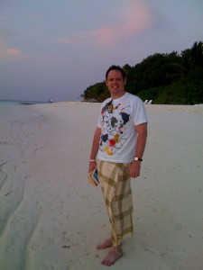

---
layout: default
title: About me
---		

&nbsp;
# About me 

This is a picture of me on my honeymoon, Maldives, back in 2008.  This feels like a lifetime ago!

{: .center-image }

{: .center-image }

My current role is Chief Technology Officer for a company called Qualtrak Solutions Ltd.  I have been in the role since 2008.  We are based in the UK.  The HQ is in Watford. All employees are distributed workers.  I am based in Southport (Nr Liverpool).  At Qualtrak we provide Agent Evaluation, Coaching and E-Learning solutions for predominately the contact centre market.  We have partners all around the world. I love all things technological. I am an early adopter of technologies. I spend most days working in the Cloud. We use both Azure and AWS.  We are a AWS Technology Partner and I am AWS Certified.

I am married to Louise, originally from Southport.  We have 2 sons. A few of my favourite pass times include exercising, reading and ju-jitsu (dan grade). I have been known to hit the occasional golf ball too.

&nbsp;

To view LinkedIn profile, <a href="http://lnkd.in/d27sjRX" target="_blank">click here</a>